# A2A Client Plugin for Dify

Connect your Dify agents to **any** external agent using the standardized Agent-to-Agent (A2A) protocol v0.3.0.

[](LICENSE)
[](https://a2a-protocol.org)

## 🌟 Overview

The A2A Client plugin enables Dify agents to communicate and collaborate with external agents that implement the A2A (Agent-to-Agent) protocol. This opens up a world of possibilities by allowing your Dify workflows to delegate specialized tasks to domain-expert agents, regardless of which platform they run on.

### What is the A2A Protocol?

The Agent-to-Agent (A2A) protocol is an open standard for enabling different AI agents to communicate with each other. Think of it as a universal translator that allows agents from different platforms to work together seamlessly.

**Key Benefits:**
- 🌐 **Universal Compatibility** - Connect Dify to agents on any platform that supports A2A
- 🔧 **Specialization** - Delegate tasks to agents with specific domain expertise
- 🚀 **Scalability** - Build agent ecosystems that can grow and evolve
- 📖 **Open Standard** - Based on JSON-RPC 2.0, not proprietary to any vendor

### Why This Plugin Matters

Without the A2A protocol, each agent platform operates in isolation. With this plugin, your Dify agents can:
- **Access specialized knowledge** - Connect to domain-expert agents (sales, research, analytics)
- **Leverage external tools** - Use capabilities that don't exist in Dify
- **Build agent networks** - Create complex workflows spanning multiple platforms
- **Collaborate asynchronously** - Submit long-running tasks and check results later

## ⚠️ Prerequisites

**Community Edition Users:**

This plugin is not yet published to the Dify Marketplace and requires disabling signature verification for installation.

**Requirements:**
- Dify Community Edition v1.0.0 or higher
- Access to set environment variables (Docker, Kubernetes, bare metal, etc.)
- Admin access to modify deployment configuration

**Cloud Edition Users:**

This plugin cannot currently be installed on Dify Cloud. We plan to submit to the Marketplace in the future.

---

## 🏗️ How It Works

### Architecture

```
┌───────────────-──┐         A2A Protocol          ┌──────────────────┐
│   Dify Agent     │◄────────(JSON-RPC 2.0)───────►│  External Agent  │
│                  │                               │                  │
│  Uses 5 Tools:   │         Over HTTP/HTTPS       │  - Sales Expert  │
│  • List          │                               │  - Research AI   │
│  • Capabilities  │       Authentication:         │  - Analytics Bot │
│  • Call (Sync)   │    Bearer / API Key / Basic   │  - Support Agent │
│  • Submit (Async)│                               │  - Custom Agent  │
│  • Status        │                               │                  │
└────────────-─────┘                               └──────────────────┘
```

### Communication Patterns

The plugin supports both **synchronous** and **asynchronous** communication:

**Synchronous (message/send):**
- Send a request → Wait for response → Get immediate result
- Best for: Quick queries, fact-checking, simple delegations

**Asynchronous (message/stream + tasks/get):**
- Submit a task → Receive taskId → Continue working → Check status later
- Best for: Complex analysis, long-running operations, resource-intensive tasks
- Uses Server-Sent Events (SSE) to stream progress updates

### JSON-RPC 2.0 Protocol

All communication uses JSON-RPC 2.0 messages with proper A2A Message objects:

```json
{
  "jsonrpc": "2.0",
  "method": "message/send",
  "params": {
    "message": {
      "kind": "message",
      "role": "user",
      "messageId": "uuid",
      "parts": [
        {
          "kind": "text",
          "text": "Your instruction here"
        }
      ]
    }
  },
  "id": "request-uuid"
}
```

## ✨ Features

This plugin provides **5 powerful tools** for A2A communication:

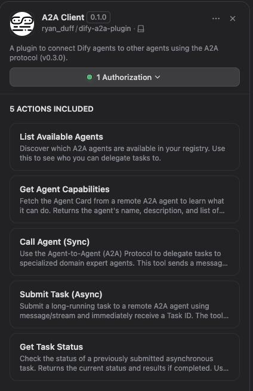

### 1. 📋 List Agents
**What it does:** Shows all agents you've configured in the registry.

**When to use:**
- Discover which agents are available
- Show users their agent options
- Debug configuration issues

**Returns:** JSON array of agent names and descriptions

> **Note:** This tool currently lists agents from your local configuration. As A2A agent registries become more common and standardized, we plan to incorporate support for querying external registries - either by enhancing this tool or adding dedicated registry query tools.

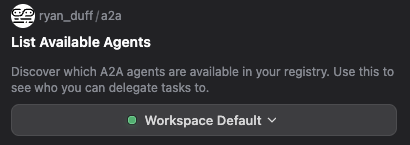

---

### 2. 🔍 Get Agent Capabilities
**What it does:** Fetches the "agent card" from a remote agent, showing what it can do.

**How it works:**
- Queries `/.well-known/agent-card.json` (or fallback to `agent.json`)
- Returns metadata: name, description, capabilities, skills, API endpoints

**When to use:**
- Before calling an unfamiliar agent
- To understand what parameters an agent accepts
- For dynamic UI generation based on agent capabilities

**Returns:** Agent card JSON with full capability information

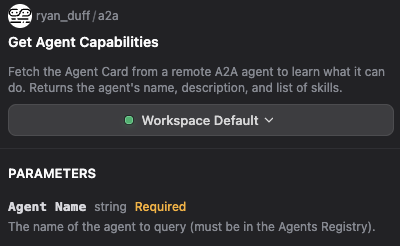

---

### 3. 💬 Call Agent (Synchronous)
**What it does:** Sends a message to an agent and waits for the complete response.

**Technical details:**
- Uses `message/send` JSON-RPC method
- Blocks until agent responds (timeout: 60 seconds)
- Best for quick operations

**When to use:**
- Simple queries that return quickly (< 60 seconds)
- When you need an immediate answer
- For interactive workflows where users are waiting

**Example use case:**
```
User asks: "What's the price of Product XYZ?"
↓
Dify calls sales_agent synchronously
↓
Sales agent responds with pricing
↓
Dify shows answer to user
```

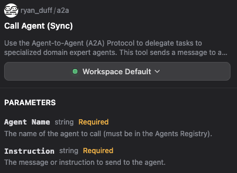

---

### 4. 📤 Submit Task (Asynchronous)
**What it does:** Submits a long-running task and returns immediately with a taskId.

**Technical details:**
- Uses `message/stream` JSON-RPC method with SSE
- Extracts taskId from first Server-Sent Event
- Closes stream immediately (true async behavior)
- Does NOT wait for completion

**When to use:**
- Complex analysis that takes minutes/hours
- Resource-intensive operations
- When you want to continue working while agent processes
- Batch operations

**Example use case:**
```
User asks: "Analyze this 100-page report"
↓
Dify submits task asynchronously
↓
Returns taskId immediately
↓
User can continue conversation
↓
Later: Check status with Get Task Status
```

**Returns:** TaskId string (e.g., `"6126d851-48f2-4376-af20-3d582e690f05"`)

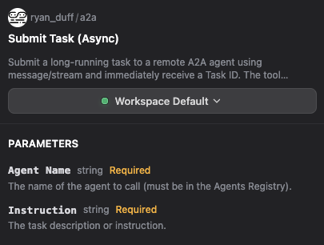

---

### 5. ✅ Get Task Status
**What it does:** Checks the status of a previously submitted asynchronous task.

**Technical details:**
- Uses `tasks/get` JSON-RPC method
- Returns current state: `submitted`, `working`, `completed`, `failed`, `canceled`

**When to use:**
- After submitting an async task
- To poll for completion
- To retrieve final results when done

**Example workflow:**
```
1. Submit task → Get taskId "abc123"
2. Wait 30 seconds
3. Get status → "working"
4. Wait 2 minutes
5. Get status → "completed" with results
```

**Returns:** Task status object with state, progress, and results (when complete)

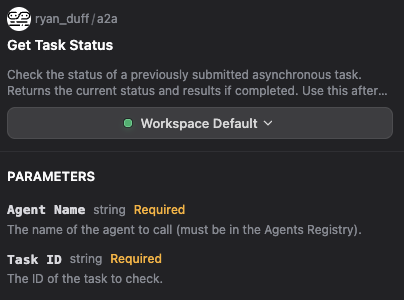

---

## 📥 Installation

### From Dify Marketplace (Coming Soon)

This plugin is pending submission to the Dify Marketplace. Once approved, it will be available for one-click installation.

### For Community Edition (Self-Hosted)

#### Step 1: Enable Unsigned Plugin Installation

Set the following environment variable in your deployment:

```bash
FORCE_VERIFYING_SIGNATURE=false
```

**Deployment-Specific Instructions:**

**Docker Compose:**
Add to your `.env` file or `docker-compose.yml`:
```bash
FORCE_VERIFYING_SIGNATURE=false
```
Restart: `docker compose down && docker compose up -d`

**Kubernetes:**
Add to your ConfigMap or deployment environment:
```yaml
env:
  - name: FORCE_VERIFYING_SIGNATURE
    value: "false"
```
Apply changes: `kubectl apply -f <your-deployment.yaml>`

**Bare Metal / Other:**
Export environment variable before starting Dify:
```bash
export FORCE_VERIFYING_SIGNATURE=false
```

⚠️ **Security Note**: This setting allows ANY unsigned plugin to be installed. Use cautiously and only install plugins you trust. Review the [source code](https://github.com/flyryan/dify-a2a-plugin) before installation.

#### Step 2: Download Plugin

Download `dify-a2a-plugin.difypkg` from:
- [Latest Release](https://github.com/flyryan/dify-a2a-plugin/releases/latest)
- [Direct Download v0.1.0](https://github.com/flyryan/dify-a2a-plugin/releases/download/v0.1.0/dify-a2a-plugin.difypkg)

#### Step 3: Install Plugin

1. In Dify, click **"Plugins"** (top-right corner)

   

2. Click **"Install Plugin → Install via Local File"**

   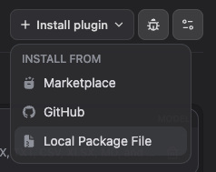

3. Select the `dify-a2a-plugin.difypkg` file

   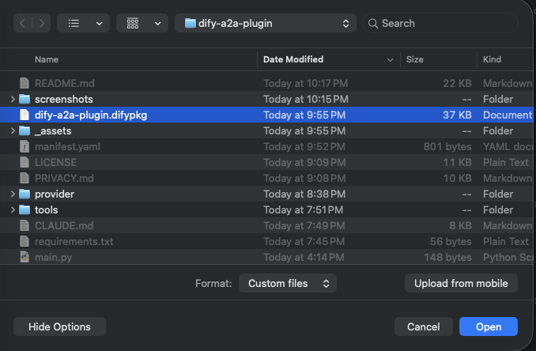

4. Click **Install** in the confirmation dialog

   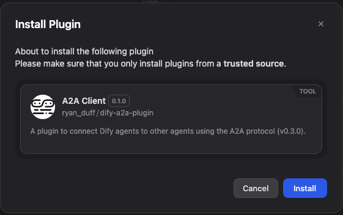

5. Installation complete!

   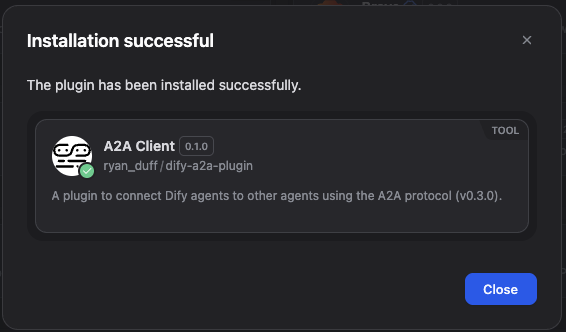

#### Step 4: Configure Agent Registry

See [Configuration](#-configuration) section below

---

## ⚙️ Configuration

### Agent Registry Setup

The plugin stores up to **5 agent configurations** using individual credential fields:

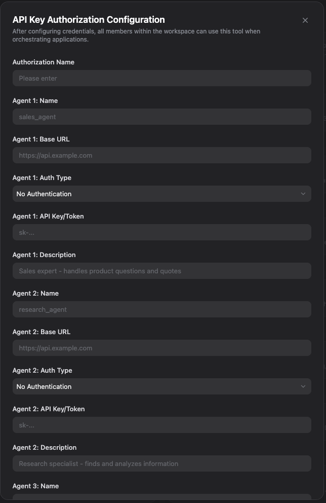

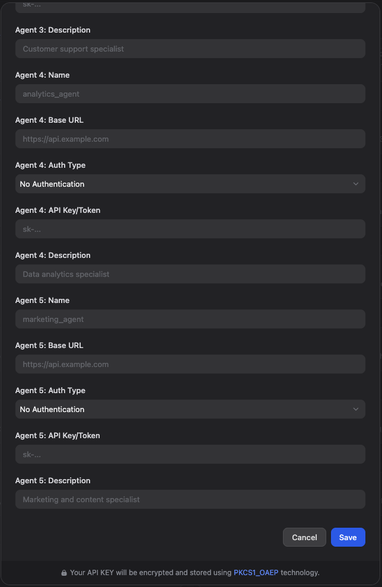

#### For Each Agent (1-5):

| Field | Required | Description | Example |
|-------|----------|-------------|---------|
| **Name** | Yes | Unique identifier for this agent | `sales_agent` |
| **Base URL** | Yes | A2A protocol endpoint | `https://api.example.com` |
| **Auth Type** | Yes | Authentication method | `bearer`, `api-key`, `basic`, or `none` |
| **API Key/Token** | Conditional | Required if auth type is not `none` | `sk-abc123...` |
| **Description** | No | Human-readable description | `Sales expert - product questions and quotes` |

#### Authentication Types Explained:

- **None** - No authentication required (public endpoints)
- **Bearer Token** - Standard OAuth 2.0 bearer token authentication
- **API Key** - Custom API key in Authorization header
- **Basic Auth** - Username:password in base64 (format: `username:password`)

#### Example Configuration:

```
Agent 1:
  Name: sales_agent
  Base URL: https://sales-api.company.com
  Auth Type: bearer
  API Key: sk-prod-abc123xyz...
  Description: Sales expert - handles product pricing and quotes

Agent 2:
  Name: research_agent
  Base URL: https://research.example.com/a2a
  Auth Type: api-key
  API Key: research_key_789
  Description: Research specialist - finds and analyzes information

Agent 3:
  (Leave blank if not needed)
```

### Important Notes:

⚠️ **Security:** API keys are stored securely in Dify's credential system and never exposed to end users.

⚠️ **Agent Endpoint Requirements:** Remote agents must implement A2A protocol v0.3.0 for compatibility.

---

## 🚀 Usage

### Basic Workflow

1. **List available agents** to see your configured agents
2. **Get agent capabilities** to understand what an agent can do
3. **Call agent** (sync) for quick queries OR **Submit task** (async) for long operations
4. **Get task status** to check on async tasks

### Adding Tools to Your Workflow

Find the A2A Client plugin in the tools browser:

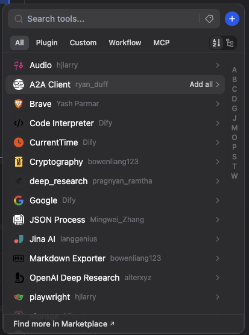

View all available tools:

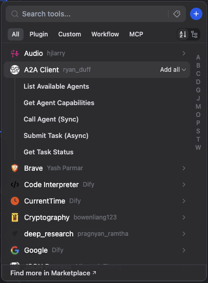

Enable the tools you need in your workflow:

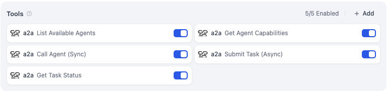

### Example: Synchronous Agent Call

**Scenario:** You need product pricing information.

1. User asks: *"What's the price for Enterprise plan?"*
2. Your Dify workflow uses **Call Agent** tool:
   - Agent Name: `sales_agent`
   - Instruction: `"Provide pricing for Enterprise plan"`
3. Sales agent responds immediately with pricing details
4. Workflow shows response to user

---

### Example: Asynchronous Task Workflow

**Scenario:** You need deep market analysis that takes 10 minutes.

1. User asks: *"Analyze competitor pricing trends for Q4 2024"*
2. Your Dify workflow uses **Submit Task** tool:
   - Agent Name: `research_agent`
   - Instruction: `"Comprehensive competitor pricing analysis for Q4 2024"`
3. Plugin returns taskId: `"abc-123-def"`
4. Workflow tells user: *"Analysis started, taskId: abc-123-def"*
5. User continues conversation or leaves
6. Later, workflow uses **Get Task Status**:
   - Agent Name: `research_agent`
   - Task ID: `"abc-123-def"`
7. Status shows `completed` with full analysis results
8. Workflow presents results to user

---

### Tool Usage Tips

**When to use List Agents:**
- At the start of a conversation to show available capabilities
- When users ask "what can you do?"
- For debugging: verify agents are configured correctly

**When to use Get Agent Capabilities:**
- Before first interaction with a new agent
- To discover agent-specific parameters
- For dynamic workflows that adapt to agent capabilities

**When to use Call Agent (Sync):**
- Simple questions with quick answers
- Interactive conversations where user is waiting
- Operations under 60 seconds
- When you need the answer to continue

**When to use Submit Task (Async):**
- Complex analysis (> 1 minute)
- Report generation
- Batch processing
- When user doesn't need immediate results

**When to use Get Task Status:**
- After submitting async tasks
- In polling workflows (check every 30-60 seconds)
- To retrieve final results
- To handle errors/failures gracefully

---

## 🔧 A2A Protocol Compliance

This plugin implements **A2A Protocol v0.3.0**, which includes:

### Supported Methods:

| Method | Purpose | Implementation |
|--------|---------|----------------|
| `message/send` | Synchronous request/response | ✅ Call Agent tool |
| `message/stream` | Asynchronous task with SSE | ✅ Submit Task tool |
| `tasks/get` | Task status retrieval | ✅ Get Task Status tool |
| `tasks/cancel` | Cancel running task | ⏳ Future enhancement |
| `tasks/resubscribe` | Resume SSE stream | ⏳ Future enhancement |

### Protocol Features:

- ✅ **JSON-RPC 2.0** over HTTP/HTTPS
- ✅ **Proper Message objects** with `kind`, `role`, `messageId`, `parts[]`
- ✅ **Agent discovery** via `/.well-known/agent-card.json`
- ✅ **Multiple auth types** (none, bearer, API key, basic)
- ✅ **Server-Sent Events (SSE)** for async streaming
- ✅ **Error handling** with standard JSON-RPC error codes

### Agent Card Support:

Agents can advertise their capabilities via agent cards:

```json
{
  "name": "Sales Expert Agent",
  "description": "Handles product questions and pricing",
  "protocolVersion": "0.3.0",
  "capabilities": {
    "streaming": true,
    "tasks": true
  },
  "skills": [
    {
      "name": "product_pricing",
      "description": "Get pricing for products"
    }
  ]
}
```

---

## 🛠️ Technical Details

### Message Format

All messages follow A2A spec with proper structure:

```json
{
  "kind": "message",
  "role": "user",
  "messageId": "550e8400-e29b-41d4-a716-446655440000",
  "parts": [
    {
      "kind": "text",
      "text": "Your instruction here"
    }
  ]
}
```

### SSE (Server-Sent Events)

Async tasks use SSE streaming for progress updates:

```
event: status-update
data: {"jsonrpc":"2.0","result":{"taskId":"abc123","state":"submitted"}}

event: status-update
data: {"jsonrpc":"2.0","result":{"taskId":"abc123","state":"working","progress":0.5}}

event: task
data: {"jsonrpc":"2.0","result":{"taskId":"abc123","state":"completed","answer":"Results here..."}}
```

The **Submit Task** tool extracts the taskId from the first event and immediately closes the stream for true async behavior.

### Error Handling

JSON-RPC error responses:

```json
{
  "jsonrpc": "2.0",
  "error": {
    "code": -32602,
    "message": "Invalid params"
  },
  "id": "request-id"
}
```

Common error codes:
- `-32700` - Parse error
- `-32600` - Invalid request
- `-32601` - Method not found
- `-32602` - Invalid params
- `-32603` - Internal error

---

## 🐛 Troubleshooting

### "Agents Registry is not configured"

**Problem:** No agents are configured in the plugin settings.

**Solution:**
1. Go to plugin configuration
2. Fill in at least Agent 1 fields (Name, URL, Auth Type)
3. If using auth, provide API key

---

### "Plugin verification has been enabled, and the plugin you want to install has a bad signature"

**Problem:** Signature verification is blocking unsigned plugin installation.

**Solution for Community Edition:**
1. Set environment variable: `FORCE_VERIFYING_SIGNATURE=false`
2. Restart your Dify deployment:
   - **Docker:** `docker compose down && docker compose up -d`
   - **Kubernetes:** `kubectl rollout restart deployment/<dify-deployment>`
   - **Bare metal:** Restart Dify service
3. Try installation again

**For Cloud Edition:**
This plugin cannot be installed on Dify Cloud until it's published to the Marketplace.

---

### "Agent 'xyz' not found in registry"

**Problem:** The agent name doesn't match any configured agent.

**Solution:**
1. Use **List Agents** tool to see available names
2. Verify spelling matches exactly (case-sensitive)
3. Check agent is actually configured

---

### "A2A Error: Missing or invalid params.id"

**Problem:** Task ID is malformed or missing.

**Solution:**
1. Verify you're using the exact taskId returned from Submit Task
2. Don't modify or truncate the taskId
3. Check taskId format: `"uuid-format-string"`

---

### "Network Error: Connection timeout"

**Problem:** Agent endpoint is unreachable or slow.

**Solution:**
1. Verify base URL is correct
2. Check agent server is running
3. Test connectivity: `curl -X POST <base_url>`
4. Check firewall/network settings
5. For sync calls: operation may exceed 60s timeout (use async instead)

---

### "A2A Error: Unauthorized" or "403 Forbidden"

**Problem:** Authentication failed.

**Solution:**
1. Verify API key is correct
2. Check auth type matches agent's requirements
3. For basic auth, ensure format is `username:password`
4. Confirm agent endpoint expects the auth method you selected

---

### Agent returns unexpected results

**Problem:** Agent response doesn't match expectations.

**Solution:**
1. Use **Get Agent Capabilities** to see what agent actually does
2. Check agent's documentation for expected input format
3. Verify agent implements A2A protocol v0.3.0
4. Review instruction clarity and specificity

---

## 💻 Development

### Repository

Source code: [https://github.com/flyryan/dify-a2a-plugin](https://github.com/flyryan/dify-a2a-plugin)

### Local Development

See [CLAUDE.md](CLAUDE.md) for detailed development instructions, including:
- Plugin structure and architecture
- Building and testing locally
- Tool implementation patterns
- A2A protocol implementation details

### Requirements

- Python 3.12+
- Dify Community Edition or Cloud
- Dependencies:
  - `dify-plugin==0.6.2`
  - `requests>=2.31.0`
  - `sseclient-py>=1.8.0`

### Testing

Unit tests with mocked dependencies:

```bash
python3 -m unittest tools/tests/test_a2a_registry.py
```

---

## 📄 License

This project is licensed under the Apache License 2.0 - see the [LICENSE](LICENSE) file for details.

---

## 👤 Contact

**Author:** Ryan Duff

- **Email:** ry@nduff.com
- **Website:** [https://github.com/flyryan](https://github.com/flyryan)
- **Issues:** [https://github.com/flyryan/dify-a2a-plugin/issues](https://github.com/flyryan/dify-a2a-plugin/issues)

---

## 🔒 Privacy

This plugin collects and stores agent configuration data (URLs, API keys, descriptions) to facilitate A2A protocol communication. All data is stored securely within Dify's credential management system.

For complete privacy details, see [PRIVACY.md](PRIVACY.md).

---

## 🚀 Marketplace Publication

We plan to submit this plugin to the Dify Marketplace. Once approved, the plugin will:

- ✅ Be officially signed (no `FORCE_VERIFYING_SIGNATURE` needed)
- ✅ Work on both Community and Cloud editions
- ✅ Appear on [marketplace.dify.ai](https://marketplace.dify.ai/)
- ✅ Receive "certified" badge
- ✅ Enable one-click installation for all users

**Marketplace submission benefits:**
- Wider distribution and visibility
- Official Dify endorsement and security review
- Automatic updates for users
- No manual environment variable configuration required

Track marketplace submission progress in [Issues](https://github.com/flyryan/dify-a2a-plugin/issues).

---

## 🤝 Contributing

Contributions are welcome! Please:

1. Fork the repository
2. Create a feature branch
3. Make your changes
4. Submit a pull request

For major changes, please open an issue first to discuss what you would like to change.

---

## 🌟 Support

If this plugin helps you build amazing agent workflows, please:
- ⭐ Star the repository
- 🐛 Report bugs via Issues
- 💡 Suggest features via Issues
- 📢 Share with the Dify community

---

## 🔗 Related Links

- [A2A Protocol Specification](https://a2a-protocol.org/)
- [Dify Documentation](https://docs.dify.ai/)
- [Dify Plugin Marketplace](https://github.com/langgenius/dify-plugins)

---

**Built with ❤️ for the Dify and A2A communities**
